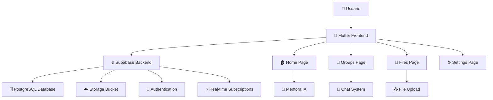

# 🌟 Sistema Lumina

<div align="center">


**Una plataforma educativa moderna y colaborativa para estudiantes universitarios**

[🚀 Demo en Vivo](#) • [📖 Documentación](#características) • [🛠️ Instalación](#instalación) • [📱 Screenshots](#capturas-de-pantalla)

</div>

---

## 🎯 **Descripción del Proyecto**

**Sistema Lumina** es una plataforma educativa integral diseñada específicamente para estudiantes universitarios que buscan una experiencia de aprendizaje colaborativa, organizada y moderna. Combina la gestión de archivos, grupos de estudio y un sistema de mentorías inteligentes en una sola aplicación.

### 🌈 **¿Qué hace especial a Lumina?**

- 🤝 **Colaboración Real**: Sistema de grupos de estudio con chat en tiempo real
- 📚 **Gestión Inteligente**: Organización automática de materiales por materia y semestre
- 🤖 **Mentora IA**: Recomendaciones personalizadas basadas en tu progreso académico
- 🎨 **Diseño Moderno**: Interfaz intuitiva y responsiva inspirada en las mejores prácticas de UX/UI
- ☁️ **Almacenamiento en la Nube**: Sincronización automática en todos tus dispositivos

---

## ✨ **Características Principales**

<details>
<summary>🏠 <strong>Dashboard Personalizado</strong></summary>

- Saludo personalizado con nombre del usuario
- Acciones rápidas para tareas comunes
- Recomendaciones inteligentes de la Mentora IA
- Vista general de materias y actividades recientes
- Integración con perfil de usuario desde Supabase Storage

</details>

<details>
<summary>👥 <strong>Sistema de Grupos de Estudio</strong></summary>

- Creación de grupos por materia, semestre y carrera
- Sistema de códigos de invitación únicos
- Chat grupal persistente en tiempo real
- Gestión de miembros y roles
- Compartición de archivos dentro del grupo
- Filtros avanzados de búsqueda

</details>

<details>
<summary>📁 <strong>Gestión de Archivos</strong></summary>

- Subida de archivos con soporte para múltiples formatos
- Categorización automática por tipo de archivo
- Sistema de filtros y búsqueda inteligente
- Descarga directa desde el navegador
- Almacenamiento seguro en Supabase Storage
- Vista previa de archivos

</details>

<details>
<summary>🤖 <strong>Mentora Inteligente</strong></summary>

- Recomendaciones personalizadas de estudio
- Análisis de progreso académico
- Sugerencias de materiales complementarios
- Recordatorios de repasos importantes
- Resúmenes automáticos de temas

</details>

<details>
<summary>👤 <strong>Perfil de Usuario</strong></summary>

- Gestión completa del perfil personal
- Foto de perfil con almacenamiento en la nube
- Historial de actividades académicas
- Configuración de preferencias
- Sistema de reputación estudiantil

</details>

---

## 🏗️ **Arquitectura del Sistema**



---

## 🛠️ **Stack Tecnológico**

### **Frontend**
- **Flutter 3.x** - Framework multiplataforma
- **Dart** - Lenguaje de programación
- **Material Design 3** - Sistema de diseño

### **Backend**
- **Supabase** - Backend as a Service
- **PostgreSQL** - Base de datos relacional
- **Row Level Security (RLS)** - Seguridad a nivel de fila
- **Real-time Subscriptions** - Actualizaciones en tiempo real

### **Almacenamiento**
- **Supabase Storage** - Almacenamiento de archivos
- **Shared Preferences** - Persistencia local

### **Herramientas de Desarrollo**
- **VS Code / Android Studio** - IDEs
- **Git** - Control de versiones
- **Firebase Hosting** - Deploy y hosting

---

## 📦 **Instalación**

### **Prerrequisitos**

```bash
# Verificar instalación de Flutter
flutter --version

# Debe mostrar Flutter 3.0.0 o superior
```

### **Pasos de Instalación**

1. **Clonar el repositorio**
```bash
git clone https://github.com/tu-usuario/sistema_lumina.git
cd sistema_lumina
```

2. **Instalar dependencias**
```bash
flutter pub get
```

3. **Configurar Supabase**
```bash
# Crear archivo lib/secrets.dart con tus credenciales
const String supabaseUrl = 'TU_SUPABASE_URL';
const String supabaseAnonKey = 'TU_SUPABASE_ANON_KEY';
```

4. **Ejecutar la aplicación**
```bash
# Para desarrollo
flutter run -d chrome

# Para producción
flutter build web --release
```

---

## 🎨 **Capturas de Pantalla**

<div align="center">

### 🏠 **Página de Inicio**
*Dashboard personalizado con saludo dinámico y acciones rápidas*

### 👥 **Grupos de Estudio**
*Sistema completo de grupos con chat en tiempo real*

### 📁 **Gestión de Archivos**
*Interfaz moderna para subir, organizar y descargar archivos*

### 💬 **Chat Grupal**
*Sistema de mensajería persistente con diseño moderno*

</div>

---

## 📊 **Estructura de la Base de Datos**

```sql
-- Tabla de usuarios
usuarios (
  id UUID PRIMARY KEY,
  name TEXT,
  email TEXT,
  profile_image_url TEXT,
  created_at TIMESTAMP,
  updated_at TIMESTAMP
)

-- Tabla de grupos
grupos (
  id UUID PRIMARY KEY,
  nombre TEXT,
  descripcion TEXT,
  codigo_invitacion TEXT,
  creador_id UUID,
  materia_id UUID,
  miembros_count INTEGER,
  archivos_count INTEGER
)

-- Tabla de mensajes de chat
chat_mensajes (
  id UUID PRIMARY KEY,
  grupo_id UUID,
  usuario_id UUID,
  mensaje TEXT,
  created_at TIMESTAMP
)

-- Tabla de archivos
archivos (
  id UUID PRIMARY KEY,
  nombre TEXT,
  tipo TEXT,
  tamano BIGINT,
  url_storage TEXT,
  usuario_id UUID
)
```

---

## 🚀 **Características Avanzadas**

### **🔒 Seguridad**
- Autenticación segura con Supabase Auth
- Row Level Security (RLS) en todas las tablas
- Validación de datos en cliente y servidor
- Manejo seguro de archivos y uploads

### **⚡ Performance**
- Lazy loading de imágenes y contenido
- Optimización de consultas a la base de datos
- Cache inteligente de datos frecuentes
- Compresión automática de archivos

### **📱 Responsividad**
- Diseño adaptativo para web, móvil y tablet
- Componentes reutilizables y modulares
- Navegación intuitiva en todos los dispositivos
- Optimización para diferentes resoluciones

---

## 🤝 **Contribución**

¡Las contribuciones son bienvenidas! Si quieres mejorar Sistema Lumina:

1. **Fork** el proyecto
2. **Crea** una rama para tu feature (`git checkout -b feature/AmazingFeature`)
3. **Commit** tus cambios (`git commit -m 'Add some AmazingFeature'`)
4. **Push** a la rama (`git push origin feature/AmazingFeature`)
5. **Abre** un Pull Request

---

## 📋 **Roadmap**

- [x] ✅ Sistema de autenticación
- [x] ✅ Dashboard personalizado
- [x] ✅ Gestión de grupos de estudio
- [x] ✅ Chat en tiempo real
- [x] ✅ Sistema de archivos
- [ ] 🔄 Notificaciones push
- [ ] 🔄 Modo offline
- [ ] 🔄 App móvil nativa
- [ ] 🔄 Integración con calendarios
- [ ] 🔄 Sistema de calificaciones

---

## 👨‍💻 **Autor**

**Desarrollado con ❤️ para la comunidad estudiantil universitaria**

- 📧 Email: [tu-email@universidad.edu]
- 🎓 Universidad: [Tu Universidad]
- 📚 Carrera: [Tu Carrera]
- 📅 Año: 2025

---

## 📄 **Licencia**

Este proyecto está bajo la Licencia MIT - ver el archivo [LICENSE.md](LICENSE.md) para más detalles.

---

## 🙏 **Agradecimientos**

- **Flutter Team** por el increíble framework
- **Supabase** por el backend as a service
- **Material Design** por las guías de diseño
- **Comunidad Open Source** por las librerías utilizadas
- **Profesores y compañeros** por el feedback y apoyo

---

<div align="center">

## 🎬 **Demo del Proyecto**

*Aquí va tu hermoso GIF mostrando la aplicación en acción*

<!-- TU HERMOSO GIF AQUÍ -->


---

**⭐ Si te gusta este proyecto, ¡dale una estrella en GitHub! ⭐**

**🚀 ¡Hecho con Flutter y mucho café! ☕**

</div>
